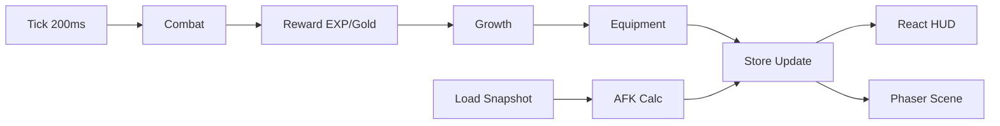

# HeroForge Project Plan

## 1. Stack Decision

- Client: React + Phaser + Zustand
- Build/Deploy: Vite + Vercel
- Test: Vitest
- Save: LocalStorage (schema versioning)

Reason:
- JS 기반으로 빠르게 구현 가능
- 로직/렌더 분리 구조가 쉬움
- 웹에서 시작하고 PWA/Capacitor 확장 가능

## 2. Directory Structure

```txt
src/
  app/              # React UI container
  game/
    core/           # pure formulas + loop
    data/           # classes/equipment static data
    systems/        # combat/growth/equipment/afk
    state/          # zustand state/actions
    render/         # phaser scene
  infra/storage/    # save/load + schema
  tests/            # formula tests
```

## 3. System Diagram



## 4. State Flow (React Developer View)

1. Loop or UI event triggers store action
2. action calls pure system function
3. function returns next state
4. store updates and components rerender via selector

## 5. MVP Roadmap

1. Phase1: auto battle, exp, level, stage
2. Phase2: class diff, skill tuning, equipment depth
3. Phase3: afk tuning, ui polish, balance simulator
